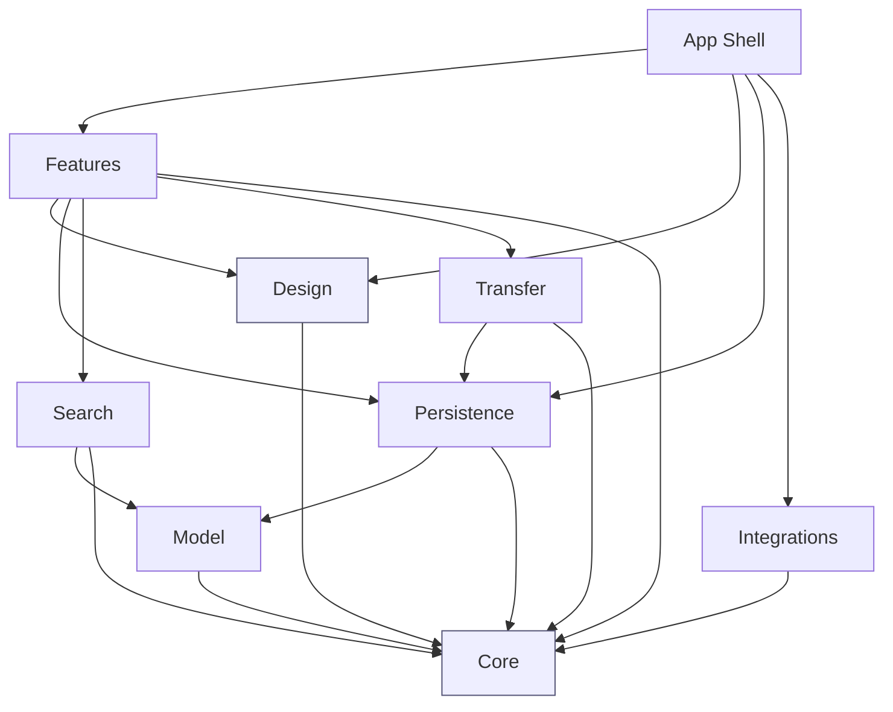

# Architecture

## Shape of the codebase

One Xcode app target (thin) over one local Swift package containing every module.
The package is the product; the app target is a shell that wires modules together
and owns entitlements, Info.plist, and assets.

```
elephruit-app/
├── Elephruit.xcodeproj              # thin, file-system-synchronized groups
├── Elephruit/                       # app shell target
│   ├── ElephruitApp.swift           # @main, scenes, commands, DI root
│   ├── AppEnvironment.swift          # composition root
│   ├── Elephruit.entitlements
│   ├── Info.plist
│   └── Assets.xcassets
├── Packages/ElephruitKit/           # all real code lives here
│   ├── Package.swift
│   ├── Sources/
│   │   ├── ElephruitCore/           # domain: value types, protocols, errors
│   │   ├── ElephruitModel/          # SwiftData @Model entities + schema
│   │   ├── ElephruitPersistence/    # container, migrations, repositories
│   │   ├── ElephruitSearch/         # query grammar, engine, Spotlight bridge
│   │   ├── ElephruitDesign/         # tokens, components, previews
│   │   ├── ElephruitTransfer/       # import/export, archive format
│   │   ├── ElephruitIntegrations/   # EventKit/Contacts/Notifications adapters
│   │   └── ElephruitFeatures/       # feature modules (views + models)
│   └── Tests/
│       ├── ElephruitCoreTests/
│       ├── ElephruitPersistenceTests/
│       ├── ElephruitSearchTests/
│       └── ElephruitTransferTests/
├── ElephruitUITests/                # XCUITest (Phase 2+)
└── docs/
```

### Why one package, many targets

- Module boundaries are enforced by the compiler, not by convention or folder names.
- `swift test` runs the whole suite in seconds with no signing, no simulator, no
  Xcode scheme.
- One `Package.swift` to maintain instead of eight; dependency edges are visible in
  a single file and therefore hard to violate by accident.
- Splitting a target into its own package later is a mechanical move if needed.

## Dependency graph

Edges point *downward only*. Any new edge that would introduce a cycle is a design
error, and the compiler will say so.



| Module | Owns | Must not know about |
|---|---|---|
| **Core** | `ItemKind`, `ItemID`, date/recurrence value types, `AppError`, protocol boundaries, `Clock`. Pure Swift, no SwiftData, no SwiftUI. | Everything else |
| **Model** | `@Model` classes, `SchemaV1`, migration plan, `#Index`/`#Unique`. | SwiftUI, features |
| **Persistence** | `ModelContainer` construction, `Repository` protocols + SwiftData implementations, undo coordination, Trash policy, sync status. | SwiftUI views |
| **Search** | Query token grammar + parser, `SearchEngine` protocol + implementation, index projection, Core Spotlight donation. | Views |
| **Design** | Primitive spacing/type/colour tokens; semantic component layers such as `FloatingCapturePanel`; `ItemRow`, `EmptyStateView`, `Chip`, `InspectorSection`; focus-ring conventions. | Domain semantics beyond `ItemKind` |
| **Transfer** | Versioned archive codec, Markdown+front-matter codec, importer pipeline with validation and duplicate detection. | Views |
| **Integrations** | EventKit, Contacts, UserNotifications, QuickLook, NaturalLanguage — each behind a protocol with a no-op default. | Domain rules |
| **Features** | One folder per feature: view + `@Observable` model. Composes the above. | Other features' internals |

The Design module has two deliberate levels. `Theme.Spacing`, `Theme.Text`, and `Theme.Colors` are
the primitives—the equivalent of CSS custom properties. Semantic layers then name recurring UI
roles and assemble those primitives into components. For example, `Theme.FloatingCapturePanel`
defines the type hierarchy, adaptive colours, and rhythm for global capture windows, while
`FloatingCapturePanelHeader`, `FloatingCapturePanelPrompt`, and `FloatingCapturePanelField` make
that hierarchy structural. Feature views consume those roles rather than choosing fonts, colours,
and borders independently. A visual change therefore has one owner, while genuine differences such
as a prompt being stronger than supporting text remain explicit rather than accidental drift.

## State and concurrency

Swift 6 language mode, strict concurrency, throughout.

- **`@MainActor` UI, actor-isolated work.** Views and their `@Observable` models are
  `@MainActor`. Parsing, indexing, import/export, and file I/O run off the main
  actor and hand back `Sendable` value types.
- **SwiftData actor discipline.** `ModelContext` is not `Sendable`. The UI uses the
  main-actor context via `@Environment(\.modelContext)`. Background work uses
  `ModelActor`-isolated contexts created from the shared `ModelContainer`, and
  communicates by `PersistentIdentifier` and plain value structs — never by passing
  a model object across an isolation boundary.
- **Observation, not Combine.** `@Observable` models; `withObservationTracking` only
  where a non-SwiftUI observer is genuinely required.
- **No singletons.** No `.shared`. Dependencies are constructed once in
  `AppEnvironment` and injected via initialisers, or via the SwiftUI environment for
  view-tree-scoped services. Tests construct their own.

### Composition root

```swift
// Elephruit/AppEnvironment.swift  (sketch — see implementation)
@MainActor
final class AppEnvironment {
    let container: ModelContainer
    let items: any ItemRepository
    let search: any SearchEngine
    let indexer: SpotlightIndexing
    let transfer: TransferService
    let calendar: any CalendarProviding      // NoopCalendarProvider by default
    let notifications: any NotificationScheduling

    static func live() throws -> AppEnvironment
    static func inMemory() throws -> AppEnvironment   // previews + tests
}
```

Every boundary crossed by a side effect — disk, network, clock, calendar, keychain,
notifications, Spotlight — is a protocol with a live implementation and a
deterministic test double. `Clock` is injected so that recurrence and "today" are
testable without freezing the machine's date.

## View layer rules

1. No `ModelContext` mutation inside a view body. Views call methods on their
   `@Observable` feature model, which calls a repository.
2. No business rule inside a view. "Completing a recurring task advances its next
   occurrence" lives in `ElephruitCore`/`Persistence` with a unit test, not in a
   button's action closure.
3. Feature models are small — one screen's worth of state and intent. When one grows
   past roughly 150 lines it is decomposed, not annotated with a comment.
4. `@Query` is allowed in leaf list views where SwiftData's own change tracking is
   the simplest correct answer; the predicate is built by a pure function in
   `Persistence` that is unit-tested independently of the view.

## AppKit usage policy

SwiftUI first. AppKit is reached for only where SwiftUI has no equivalent, always
wrapped and confined to a named file with a comment stating the reason:

| Need | Mechanism | Reason SwiftUI is insufficient |
|---|---|---|
| Editor with precise selection, ranges, and find | `NSViewRepresentable` over `NSTextView` (TextKit 2) | `TextEditor` exposes no selection or scroll API and no find bar |
| Quick Capture as a floating utility panel | `NSPanel` via a small window-controller bridge | `Window` scenes cannot be non-activating utility panels |
| Quick Look previews | `QLPreviewPanel` | No SwiftUI surface |
| Services / Share menu wiring (later) | `NSApplicationDelegate` adaptor | — |

## Multiplatform readiness

The macOS experience is not compromised for portability, but portability is not
foreclosed:

- Core / Model / Persistence / Search / Transfer are platform-agnostic today and
  compile for iOS unchanged. Only Design and Features contain macOS idioms.
- Features that will differ per platform (navigation container, toolbars, editor
  chrome) are behind small view protocols so an iOS variant is an additional
  conformance, not a rewrite.
- Widget, menu-bar, and share extensions will consume the same package targets and
  the same App Group-scoped container. Container URL resolution is already routed
  through one function so an App Group can be introduced without touching call sites.
