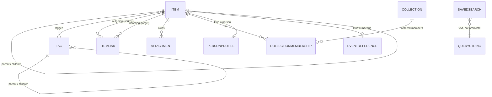

# Domain model

## The central decision: one node type

Everything the user can link, tag, search, favourite, archive, or trash is an
**`Item`**, discriminated by `kind`. Kind-specific detail that is substantial lives
in a satellite entity in a one-to-one relationship.

### Why not one entity per kind

SwiftData has no polymorphic relationships. With separate `Note`, `Task`, `Project`,
`Person` classes, the link entity degenerates into

```swift
// what we are avoiding
final class ItemLink {
    var sourceNote: Note?; var sourceTask: Task?; var sourceProject: Project?  // …
    var targetNote: Note?; var targetTask: Task?; var targetProject: Project?  // …
}
```

— nine optional fields per endpoint, every one a nullability bug waiting to happen,
and a tag-to-anything relationship needs the same treatment again. Search becomes a
union of N queries with N result mappings. Trash becomes N restore paths. The
product's core premise is *anything links to anything*, and this shape fights it.

### Why not a `ContentItem` protocol over separate entities

A protocol gives uniform *reading* but not uniform *storage*: the relationship
problem above is unchanged, because a SwiftData relationship must name a concrete
`PersistentModel`. A protocol here would be decoration over the same pain. So:
`ContentItem` exists in `ElephruitCore` as a **read-only view protocol** used by
the design system and export codecs, and `Item` is the single persisted node.

### The cost, stated honestly

`Item` is a wide, sparse row: a note carries `dueAt`, a task carries `body`. The
mitigations are:

- **`ItemKind` declares what it uses.** `ItemKind.supportedFields` is the single
  place that says "tasks have due dates, notes do not", and `ItemValidator` enforces
  it on save. Violations are caught by tests, not by convention.
- **Sparse columns are cheap.** SQLite stores `NULL` in ~1 byte; the width is a
  modelling wart, not a performance one.
- **The UI never sees the wide shape.** Feature models expose kind-appropriate
  projections; no view reads `item.recurrenceData` on a note.

---

## Entities

### `Item` — the graph node

| Group | Property | Type | Notes |
|---|---|---|---|
| Identity | `id` | `UUID` | Stable across export/import. Indexed. Uniqueness enforced in the repository (CloudKit forbids unique constraints). |
| | `kindRaw` | `String` | `ItemKind` raw value. Stored raw for predicate friendliness and forward compatibility with unknown kinds. |
| Content | `title` | `String` | `""` allowed; lists show a derived placeholder. |
| | `body` | `String` | Markdown-compatible plain text. |
| | `searchText` | `String` | Denormalised projection, recomputed on save. Indexed. |
| Timestamps | `createdAt`, `updatedAt` | `Date` | |
| | `startAt`, `dueAt`, `deferUntil`, `completedAt` | `Date?` | |
| | `archivedAt`, `deletedAt` | `Date?` | Soft delete + archive. `deletedAt != nil` ⇒ in Trash. |
| State | `statusRaw` | `String` | `ItemStatus`: `none`, `open`, `completed`, `cancelled`. |
| | `isFavorite`, `isPinned` | `Bool` | |
| | `priorityRaw` | `String` | `none`/`low`/`normal`/`high`. |
| | `sortOrder` | `Double` | Sparse ordering (gap-based) so a reorder writes one row, not N. |
| Recurrence | `recurrenceData` | `Data?` | JSON-encoded `RecurrenceRule` value type. |
| Presentation | `symbolName`, `colorName` | `String?` | SF Symbol / semantic palette key for projects, areas, collections. |
| Provenance | `sourceKindRaw`, `sourceURLString`, `sourceIdentifier` | `String?` | Where it came from: manual, quick capture, import (with importer name), Contacts, EventKit. |
| Extension | `userMetadataData` | `Data?` | JSON `[String: MetadataValue]`. Escape hatch for user-defined fields, never used by app logic. |
| Day key | `dayKey` | `String?` | `yyyy-MM-dd` for `.dailyEntry`. Indexed. |

Relationships (all optional or defaulted, all with inverses, no `.deny` rules):

| Relationship | Type | Delete rule | Meaning |
|---|---|---|---|
| `parent` / `children` | `Item?` / `[Item]` | `.cascade` on children | The one containment hierarchy: Area ▸ Project ▸ Task ▸ Subtask; Note/Bookmark ▸ any of the above. Legal pairs enforced by `ItemKind.canContain(_:)`. |
| `tags` / `Tag.items` | `[Tag]` | `.nullify` | Many-to-many. |
| `outgoingLinks` / `ItemLink.source` | `[ItemLink]` | `.cascade` | |
| `incomingLinks` / `ItemLink.target` | `[ItemLink]` | `.cascade` | Backlinks are a query over this, never stored twice. |
| `attachments` / `Attachment.owner` | `[Attachment]` | `.cascade` | |
| `memberships` / `CollectionMembership.item` | `[CollectionMembership]` | `.cascade` | |
| `personProfile` | `PersonProfile?` | `.cascade` | Only for `.person`. |
| `eventReference` | `EventReference?` | `.cascade` | Only for `.eventReference` / meetings. |
| `participants` / `Item.interactions` | `[Item]` / `[Item]` | `.nullify` | Interaction ⇄ Person, modelled as an explicit `ItemLink` of kind `.participant` rather than a second self-relationship — see note below. |

> **One self-relationship only.** `parent`/`children` is the *only* direct
> self-referencing relationship on `Item`. Every other item-to-item association goes
> through `ItemLink`, which keeps SwiftData's inverse bookkeeping simple and gives
> every association room for its own metadata.

### `ItemKind`

`note`, `task`, `project`, `area`, `person`, `organization`, `interaction`,
`meeting`, `bookmark`, `dailyEntry`, `idea`, `goal`, `decision`, `reference`.

Declared in `ElephruitCore` as a `String`-backed enum with an
`unknown(String)`-style tolerant decoder, so an archive written by a newer version
imports without data loss.

**v1 ships UI for:** `note`, `task`, `project`, `area`, `bookmark`, `dailyEntry`.
The remaining kinds exist in the schema so that Phase 3 adds views, not migrations.

### `Tag`
`id`, `name`, `slug` (normalised, case-folded, used for matching), `colorName`,
`createdAt`, `parent: Tag?` / `children: [Tag]` (hierarchical: `work/clients/acme`),
`items: [Item]`.

### `Collection` and `CollectionMembership`
A `Collection` is a **manually ordered** grouping — the thing a tag cannot be.
Order is real data, and SwiftData to-many relationships are unordered, so the
membership is explicit:

`CollectionMembership`: `id`, `position: Double`, `addedAt`, `collection: Collection?`,
`item: Item?`. This is the canonical example of *a relationship that needs its own
metadata*.

### `SavedSearch`
`id`, `name`, `queryString` (the same token grammar the user types), `symbolName`,
`sortOrder`, `showsInSidebar: Bool`, `createdAt`. Stored as a **query string, not a
compiled predicate** — durable across versions and exportable as text.

### `Attachment`
`id`, `filename`, `typeIdentifier` (UTI string), `byteCount`, `contentHash`
(SHA-256, for duplicate detection), `createdAt`, `storageKindRaw`
(`managedCopy` | `externalBookmark`), `relativePath` (for managed copies, under
`Attachments/<id>/`), `bookmarkData: Data?` + `lastKnownPath` (for external files),
`extractedText: String?` (on-device OCR/NL output, Phase 3), `owner: Item?`.

### `PersonProfile`
`id`, `givenName`, `familyName`, `emailsData`, `phonesData` (JSON arrays of labelled
values), `birthday: Date?`, `roleTitle`, `contactsIdentifier: String?` (soft link
into the Contacts store; Contacts remains authoritative for what it owns),
`item: Item?`.

### `EventReference`
`id`, `calendarItemIdentifier`, `cachedTitle`, `startAt`, `endAt`, `calendarName`,
`lastRefreshedAt`, `item: Item?`. A **cache and a pointer** — EventKit is
authoritative for calendar content, and this record is refreshed, never merged.

---

## Relationship diagram



## Invariants (each with a unit test)

1. `deletedAt != nil` ⇒ hidden from every view except Trash; children are trashed
   with the parent, and restoring the parent restores the cascade.
2. `statusRaw == .completed` ⇔ `completedAt != nil`.
3. Only `ItemKind.supportsStatus` kinds may leave `status == .none`.
4. `parent` must satisfy `parent.kind.canContain(child.kind)`; cycles are rejected.
5. `searchText` is always the current projection of `title`, `body`, tag slugs, and
   person names — asserted after every mutation path in tests.
6. Completing a recurring task sets `completedAt` on the occurrence and creates the
   next occurrence with a fresh `id`, preserving links to the series parent.
7. An `ItemLink` with `target == nil` and a non-nil `unresolvedTitle` is a valid
   *unresolved* wiki-link, and resolves automatically when an item with that title
   appears.
8. Trashing an item never destroys attachment bytes; permanent deletion does, and
   only after the store transaction commits.
